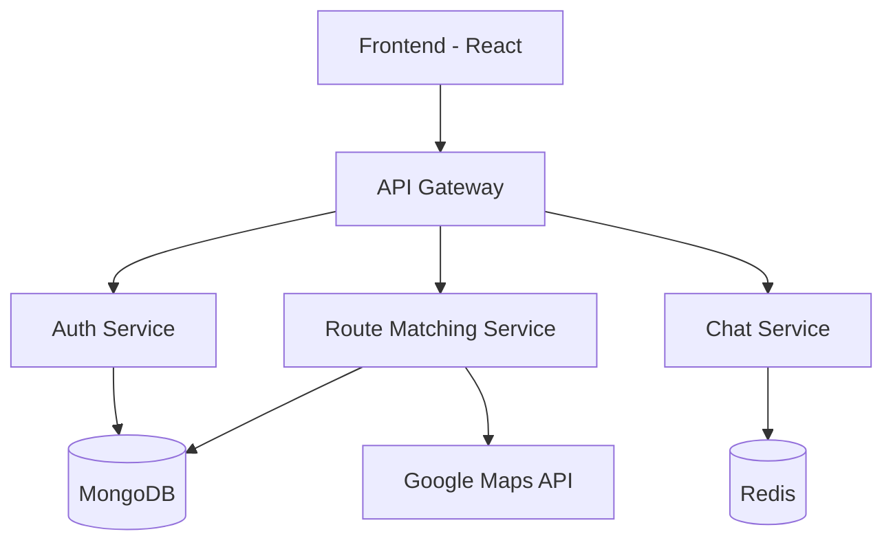

# Student Commute Optimizer 🚗 🎓

[](https://opensource.org/licenses/MIT)
[](https://github.com/ellerbrock/typescript-badges/)
[](http://makeapullrequest.com)

> A smart platform that revolutionizes student transportation through intelligent route-matching and secure communication.

## 📋 Table of Contents
- [Overview](#overview)
- [System Architecture](#system-architecture)
- [Key Features](#key-features)
- [Technology Stack](#technology-stack)
- [Getting Started](#getting-started)
- [API Documentation](#api-documentation)
- [Contributing](#contributing)
- [License](#license)

## 🌟 Overview

Student Commute Optimizer tackles the daily transportation challenges faced by students:
- 💰 High transportation costs
- 🌍 Environmental impact
- ⏰ Time efficiency
- 🛡️ Safety concerns
- 🤝 Finding compatible travel companions

## 🏗️ System Architecture

Below is the high-level architecture of our system:



## 🔑 Key Features

### 🎭 Anonymous Identity System
- Unique system-generated usernames
- End-to-end encrypted communication
- Zero personal data exposure

### 🎯 Smart Schedule Matching
- AI-powered route compatibility
- Schedule optimization
- Real-time availability tracking

### 🛣️ Dynamic Route Optimization
- Real-time traffic analysis
- Multiple pickup points
- Weather-aware routing

### 🛡️ Safety First Approach
- Student ID verification
- Emergency features
- Real-time tracking
- Rating system

## 🛠️ Technology Stack

### Backend Infrastructure
- **Runtime**: Node.js & Express
- **Language**: TypeScript
- **Database**: MongoDB with Mongoose
- **Real-time**: Socket.IO
- **Caching**: Redis
- **Auth**: JWT

### Frontend Stack
- **Framework**: React with TypeScript
- **UI Library**: Material-UI
- **Maps**: Google Maps API
- **State**: React Query
- **Real-time**: Socket.IO Client

## 🚀 Getting Started

### Prerequisites
- Node.js (v18+)
- MongoDB
- Redis
- Google Maps API key

### Installation

1. Clone the repository:
```bash
git clone https://github.com/yourusername/student-commute-optimizer.git
```

2. Install dependencies:
```bash
# Backend setup
cd backend
npm install

# Frontend setup
cd frontend
npm install
```

3. Environment setup:
```bash
# Backend .env
MONGODB_URI=your_mongodb_uri
JWT_SECRET=your_jwt_secret
GOOGLE_MAPS_API_KEY=your_api_key

# Frontend .env
REACT_APP_API_URL=http://localhost:3000
REACT_APP_GOOGLE_MAPS_KEY=your_api_key
```

4. Start the application:
```bash
# Backend
npm run dev

# Frontend
npm start
```

## 📚 API Documentation

API documentation is available at `/api/docs` when running the server locally.

Example endpoints:
- `POST /api/auth/register` - User registration
- `POST /api/routes/match` - Find route matches
- `GET /api/profile` - Get user profile

## 🤝 Contributing

1. Fork the repository
2. Create your feature branch (`git checkout -b feature/AmazingFeature`)
3. Commit your changes (`git commit -m 'Add some AmazingFeature'`)
4. Push to the branch (`git push origin feature/AmazingFeature`)
5. Open a Pull Request

## 📄 License

This project is licensed under the MIT License - see the [LICENSE](LICENSE) file for details.

---

Made with ❤️ by Student Commute Optimizer Team

