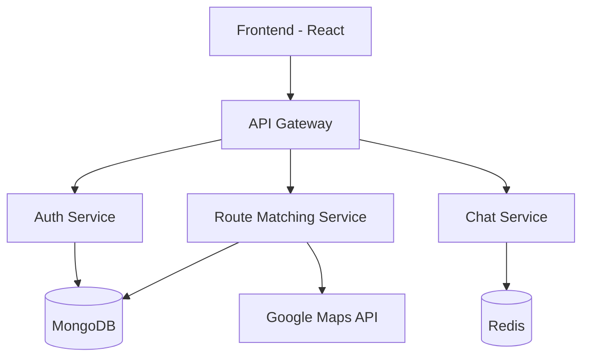

# Student Commute Optimizer 🚗 🎓

> A smart platform that revolutionizes student transportation through intelligent route-matching and secure communication.

## 📋 Table of Contents
- [Overview](#overview)
- [System Architecture](#system-architecture)
- [Key Features](#key-features)
- [Technology Stack](#technology-stack)
- [Getting Started](#getting-started)
- [API Documentation](#api-documentation)
- [Contributing](#contributing)
- [License](#license)

## 🌟 Overview

Student Commute Optimizer tackles the daily transportation challenges faced by students:
- 💰 High transportation costs
- 🌍 Environmental impact
- ⏰ Time efficiency
- 🛡️ Safety concerns
- 🤝 Finding compatible travel companions

## 🏗️ System Architecture

Below is the high-level architecture of our system:

## 🔑 Key Features

### 🎭 Anonymous Identity System
- Unique system-generated usernames
- End-to-end encrypted communication
- Zero personal data exposure

### 🎯 Smart Schedule Matching
- AI-powered route compatibility
- Schedule optimization
- Real-time availability tracking

### 🛣️ Dynamic Route Optimization
- Real-time traffic analysis
- Multiple pickup points
- Weather-aware routing

### 🛡️ Safety First Approach
- Student ID verification
- Emergency features
- Real-time tracking
- Rating system

## 🛠️ Technology Stack

### Backend Infrastructure
- **Runtime**: Node.js & Express
- **Language**: TypeScript
- **Database**: MongoDB with Mongoose
- **Real-time**: Socket.IO
- **Caching**: Redis
- **Auth**: JWT

### Frontend Stack
- **Framework**: React with TypeScript
- **UI Library**: Material-UI
- **Maps**: Google Maps API
- **State**: React Query
- **Real-time**: Socket.IO Client

